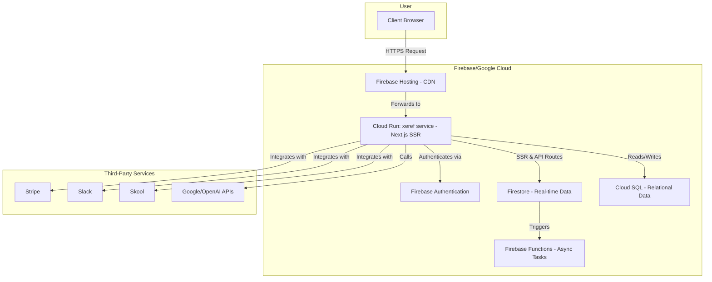

# Xeref.ai Blueprint

## 1. Overview

Xeref.ai is a full-stack web application designed as a central hub for AI-powered productivity and community engagement. It integrates a variety of AI models, task management features, and external services to provide a comprehensive user experience.

## 2. Solution Architecture

The application is built on a modern, server-rendered architecture using Google Cloud and Firebase services. Firebase App Hosting provides a managed environment for the Next.js backend, which runs on Cloud Run.

### 2.1. Architectural Diagram

### 2.2. Core Components

-   **Frontend (Firebase Hosting):** A Next.js application served via Firebase Hosting, which provides a global CDN for optimal performance.
-   **Backend (Cloud Run via App Hosting):** A set of Next.js API routes and server-side rendering logic running in a managed Cloud Run service (`xeref`). This handles all dynamic logic.
-   **Databases:**
    -   **Cloud Firestore:** Used for real-time data, chat history, and user-facing features.
    -   **Cloud SQL (PostgreSQL/MySQL):** Used for structured, relational data requiring complex transactions.
-   **Authentication:** Firebase Authentication for secure user management and sign-in.
-   **Asynchronous Tasks (Firebase Functions):** Used for background processing, database triggers, and long-running jobs that are separate from the main application request/response cycle.
-   **Infrastructure as Code (Terraform):** The entire cloud infrastructure is managed declaratively using Terraform, ensuring consistency and repeatability across environments.

## 3. Core Features

-   **User Authentication:** Secure sign-in and account management.
-   **Interactive Chat:** A real-time chat interface with a variety of AI models (**Google Gemini**, **OpenAI GPT**, **Deepseek R1**).
-   **Task Management:** A comprehensive task management system with AI-powered features.
-   **AI-Powered Explanations (Ultra Explain):** A feature to generate in-depth explanations on various topics.
-   **Speech-to-Text Transcription:** Functionality to convert spoken audio into text.
-   **External Integrations:** Connections to external services like Slack, Skool, and YouTube.
-   **Billing and Subscriptions:** Integration with Stripe for handling payments and subscriptions.
-   **Learning Resources:** A dedicated page for articles, guides, and tutorials.

## 4. Key Pages and Components

-   **`/login`:** The main entry point for users, featuring an embedded introductory video.
-   **`/` (Home):** The main application view, with a three-panel resizable layout.
    -   **Left Panel:** Main navigation and chat history.
    -   **Center Panel:** The main chat interface.
    -   **Right Panel:** A multi-purpose panel for tasks, ideas, notes, and settings.
-   **`/pricing`:** The pricing page with a four-tier subscription model.
-   **`/changelog`:** A page that displays the latest updates and changes to the application.
-   **`/learning`:** A hub for learning resources and tutorials.

## 5. Technology Stack & Development Environment

-   **Framework:** Next.js with TypeScript.
-   **Styling:** Tailwind CSS with Shadcn/ui.
-   **Deployment:**
    -   **Frontend:** Firebase Hosting (CDN)
    -   **Backend:** Firebase App Hosting (Managed Cloud Run)
-   **Infrastructure as Code:** Terraform.
-   **IDE Configuration:** The `.idx/dev.nix` file is used to configure the development environment in Firebase Studio (formerly Project IDX).
